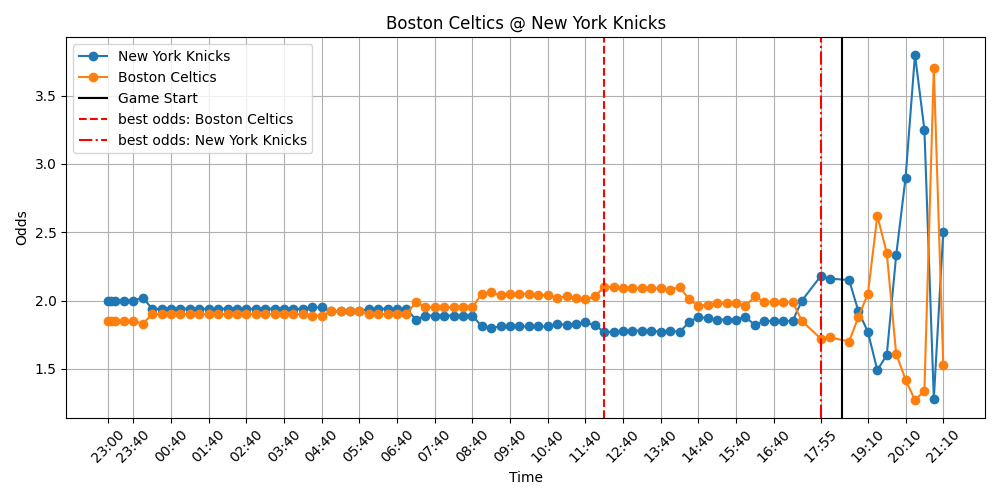

## NBA Odds Scraper with AWS Lambda, S3, and Docker

This repository contains a solution that leverages AWS Lambda, AWS S3, and Docker to scrape and process NBA game odds.

### Docker Files

The necessary Docker files to create a Docker container are located in the `docker-image-files` folder. Once the container is uploaded to AWS Lambda and configured with a periodic trigger, it will scrape NBA odds from [sportsbet.com.au](https://sportsbet.com.au). These odds are then stored in an S3 bucket (while AWS RDS may be a better fit for some use cases, S3 offers a more generous free tier).

### Data Processing

Additional code is responsible for downloading the scraped data from the S3 bucket and processing it, making it easy to track fluctuations in NBA odds over time.

### Key Observations

A key insight is that NBA odds often fluctuate in a way that allows well-timed bets to guarantee a profit, regardless of the game's outcome. Consider the example of the Boston vs. New York game below:

At 12 pm, the Celtics had odds of `$2.10`, while just before the game, New York's odds were `$2.18`. With a total of `$200` to wager, placing `$101.87` on the Celtics and `$98.13` on New York would result in a guaranteed profit of `$13.93`, regardless of the game's outcome. This represents a `6.96%` profit on the total wager. The maximum potential return for any game can be computed with the `examine_data` notebook.

While such a swing in odds doesn't always happen, there are reasons that the movement of odds could be somewhat predictable. For example, betting companies often adjust the odds when one team attracts significantly more bets than the other. This may occur when a team with a large fan base plays on a Friday or Saturday night.

The ultimate goal of this project is to leverage machine learning to identify when odds fluctuations are likely to occur and use this information to replicate the strategy demonstrated above. That strategy is: placing two bets – one on each team – when the odds are favorable, thereby guaranteeing a profit.
